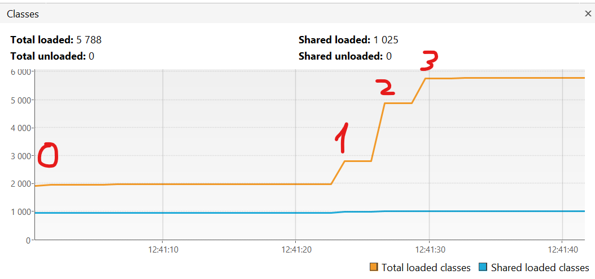
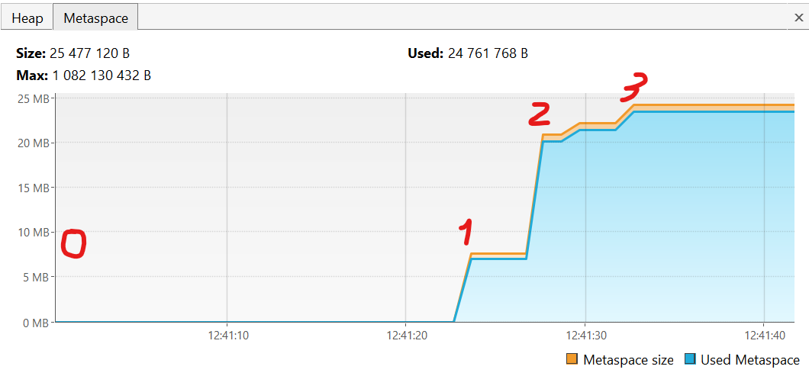
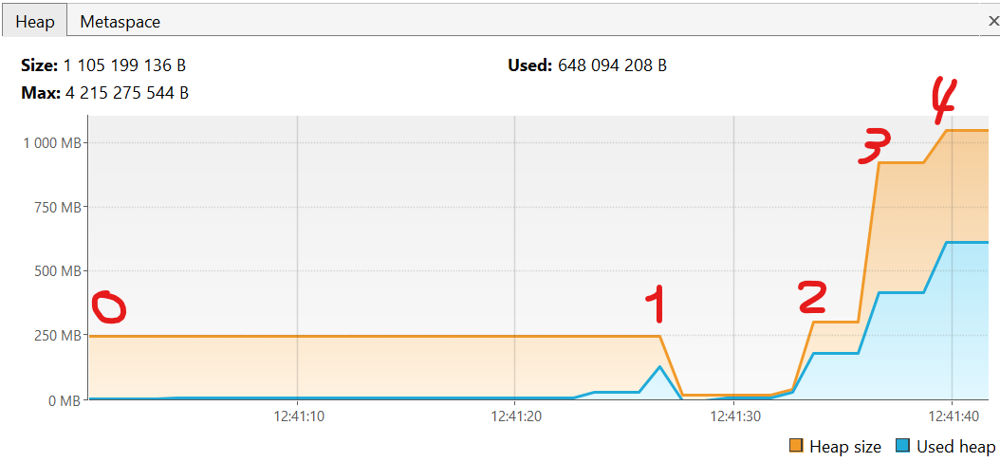

### Задание 1 ###

В начале происходит работа загрузчика классов. В начале будет происходить поиск данных классов (тех, то используются в программе). Первым осуществляет загрузку базовых классов Bootstrap Classloader, затем уже Application ClassLoader (классов, описанных нами в программе - JvmComprehension). Между ними также будет пытаться проводить загрузку Platform ClassLoader. Однако в связи с тем, что у нас нет классов из сторонних библиотек, то загружать ему будет нечго.

Далее происходит процесс Связывания. Он подразделяется на проверку валидности кода - нет ли в нем ошибок компиляции,  подготовку классов к выполнению, подготовку примитивов в статических полях и связывание ссылок на другие классы.

Далее происходит адействование Областей памяти в процессе выполнения программы. Происходит сохранение информации о Классе (JvmComprehension) в метаспэйсе. Там происходит сохранение о его полях, методах и константах. Далее происходит сохранение данных в стэке и хипе. В Стэке происходит сохранение в рамках фреймов. Данные фреймы образуется при каждом новом вызове метода и хранят информацию внутри себя о переменных примитивов и их значения, а также ссылки на значения переменных ссылочного типа. В хипе же храняться значения переменных ссылочного типа до тех пор, пока они не будут удалены сборщиком мусора. На примере данной программы:

1. создание фрейма main и сохранение в нем переменной i примитивного типа int со значением 10;
2. создание в хипе объекта класса Object и соответствующей ему во фрейме main ссылки на этот объект o;
3. создание в хипе объекта класса Integer со значением 2 и соответствующей ему во фрейме main ссылки на этот объект ii;
4. создание фрейма printAll в стеке и формировние параметров: ссылка о на объект Object в хипе, переменной i в данном новом фрейме со значением 1, ссылки на объект Integet со значением 2 в куче (ссылки формируются и храняться в стеке и соответствующем фрейме, а вот сами объекты в куче новые не создаются - новые ссылки просто привязываются к ранее созданным объектам);
5. создание в хипе объекта класса Integer со значением 700 и соответствующей ему во фрейме prinAll ссылки на этот объект uselessvar;
6. cоздание фрейма println в стеке и формировние параметров по аналогии с шагом 4, но с одним исключением - так как происходит вызов метода toString, то под него тоже формируется отдельный фрей в стеке, результат выполнения которого запишется в фрейм println
7. создание фрейма println в стеке и формировние параметров: ссылка о на объект String в хипе со значением "finished".

### Задание 2 ###

Данная программа в начале своей работы загружает большое кол-во классов из сторонних библиотек - отображение работы загрузчика классов. на скриншоте ниже состояние 0 - это начало работы программы (до первого испольщования метода loadToMetaspaceAllFrom()). Состояние 1 - загрузка классов из пакета io.vertx, состояние 2 - загрузка классов io.netty и состояние 3 - загрузка классов org.springframework.

При рассмотрении графика классов, нельзя обойти стороной график метаспейса. Состояние 0 характеризует начало работы программы. Мы ещё не создали никаких объектов классов, поэтому память не используется. Всё начинается со состояния 1 (по таймкоду оно соответствует аналогичному состоянию в classes). Далее же мы начинаем импортировать классы, как указано выше и сохранять информацию о них (используемы методы, статические поля). Состояния на этом графике идут в аналогичном порядке и соотношении с происходящим в программе, что и у графика classes.

Заключительным является график кучи. В нем оображается созданные объекты ссылочных типов и их значения. В начальном состоянии (0) происходит выделение базового объема памяти для него в размере 250Mb. Далее происходит работа сборщика мусора (состояние 1), в рамках которого происходит уменьшение хипа за ненадобностью. В последующих состояних отображено задействование новой памяти и увеличение запаса хипа при вызовах последовательных 3-х вызовах метода createSimpleObjects().

